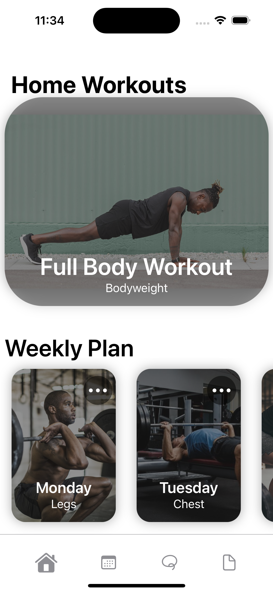

# Fitness App

This project was created in xCode.  
I have created this project to get experience within app developement  
and coding in Swift as well as getting a notebook replacement in the gym.   

### App Features:

`Tailor workouts to your own need`  
`Log workouts`  
`Log sets, reps and weight for each exercise`  
`See progress comparing old workouts to new ones`  

##

### `Home Screen`

This is the Home Screen.  
Here the user can edit the names of each of the seven day-cards.  
Inside the day-cards is where each workout is kept.  
Hoping to have a link to App Store soon, working on final touches  
for apple to approve the app.  

 
 

##

### `Workouts`

This is the Workout Screen  
Here we can add and remove exercises.  
The next step for the app is to start a  
workout and save them in a calendar.  

 
 

